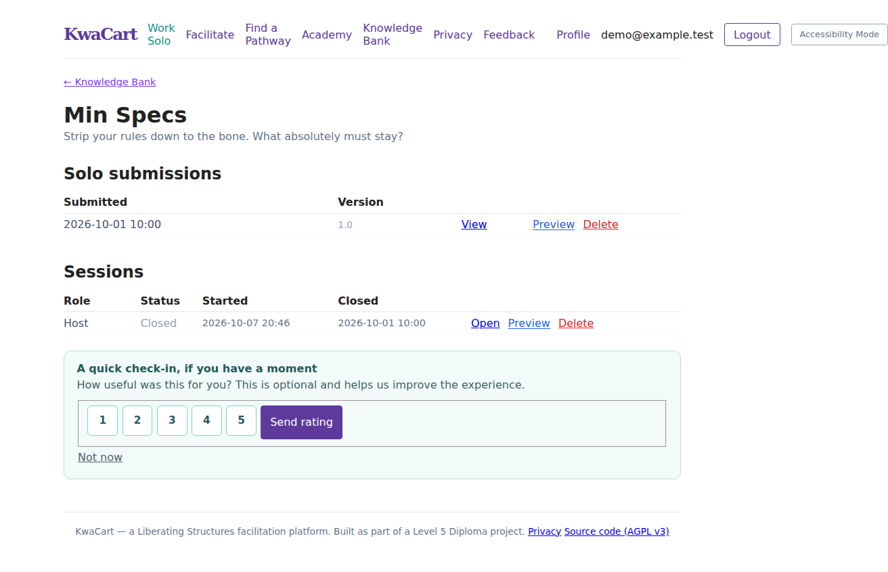
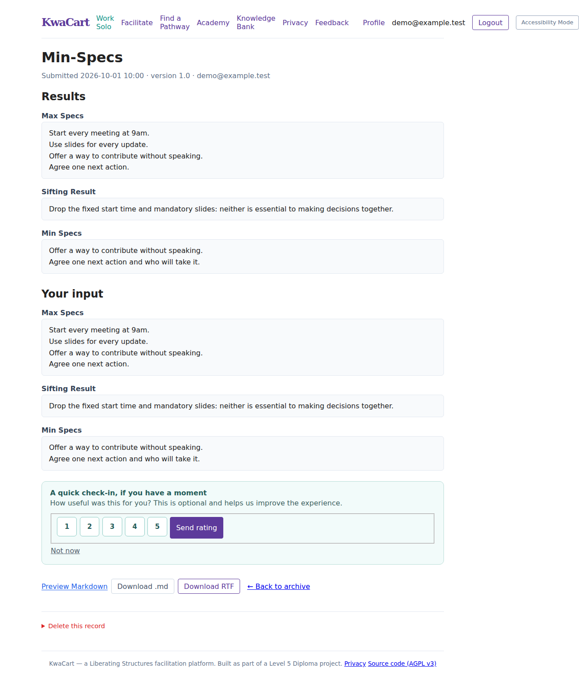
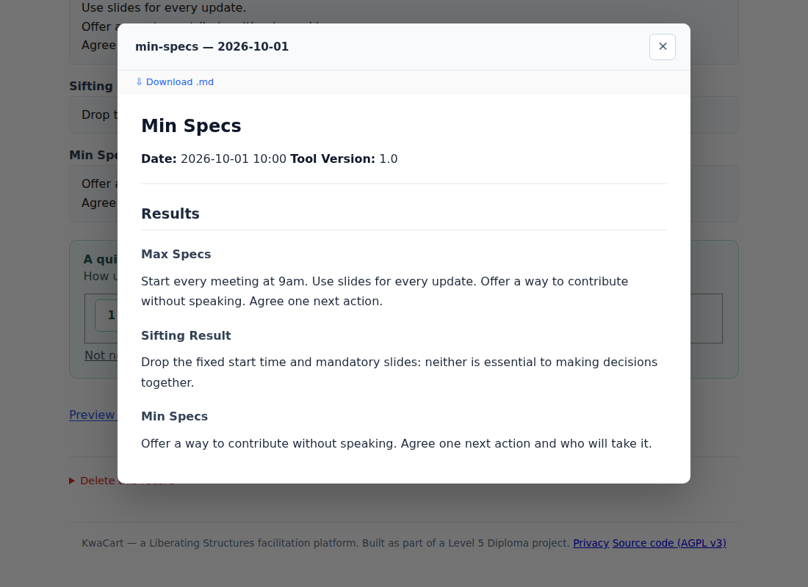

# Run KwaCart yourself

KwaCart is free self-hosted facilitation software. It includes all tools, live
sessions, the Academy, archives and exports. There is no subscription,
checkout or payment requirement.

This is a browser-based application you run, not a desktop executable. Download
the source from [QualityLemons/kwacart-selfhost](https://github.com/QualityLemons/kwacart-selfhost)
using **Code → Download ZIP** and extract it, or clone the repository:

```sh
git clone https://github.com/QualityLemons/kwacart-selfhost.git
cd kwacart-selfhost
```

KwaCart's software is licensed under GNU Affero General Public License v3.0
(`AGPL-3.0-only`); see `LICENSE` and `NOTICE`. Third-party libraries and
attributed content retain their respective rights and licences. The software is
provided without warranty.

## Screenshots and archived outputs

These screenshots show KwaCart's real interface using **fictional demonstration
data**. The examples use Min Specs; other tools save their own activity fields.
They are not records of an actual workshop.

### Browse previous work

The **Knowledge Bank** groups your work by tool. Inside a tool's archive, solo
submissions and collaborative sessions are listed separately, with dates and
links to view results. Access is limited to authorised users; archiving does
not publish a workshop on the internet.



### Open an archived result

A solo record shows the tool name, submission date, tool version, **Results**
and **Your input**. In this example, the original rules, the rules removed during
sifting and the final minimum list remain visible. Download buttons appear when
the export files were successfully generated.



### Preview and download the output

**Preview Markdown** opens a formatted, readable preview without leaving the
archive. You can also download the files and keep them outside KwaCart.



| Output | What it contains | How to use it |
| --- | --- | --- |
| Archive page | Saved result fields and, for solo work, the original input | Review work inside your own KwaCart instance |
| Markdown (`.md`) | Tool heading, date/version metadata and named result sections | Open in a text editor or Markdown viewer; copy into notes or documentation |
| Rich Text Format (`.rtf`) | A formatted document containing the activity results and metadata | Open in Word, LibreOffice or another RTF-compatible editor |
| Closed-session exports | One combined document with session metadata and a section for each participant's saved contribution | Keep a workshop record without opening each contribution separately |

**Try the actual generated example files:**

- Solo Min Specs: [view Markdown](docs/examples/min-specs-solo.md) ·
  [download/open RTF](docs/examples/min-specs-solo.rtf).
- Collaborative Min Specs: [view combined Markdown](docs/examples/min-specs-session.md) ·
  [download/open combined RTF](docs/examples/min-specs-session.rtf).

On GitHub, use **Raw** or **Download raw file** to save an example file rather
than the surrounding GitHub page. Participant email addresses in these samples
use the reserved `example.test` domain.

Exports contain the saved responses, not an automatically written evaluation
or facilitator report. The solo export contains result fields; the original
input remains available on the archive page. Collaborative exports identify
contributors, so review them before sharing. Supported drawings are embedded
when their image can be read; attachment transcriptions or links may appear in
session exports. External attachment links can stop working if their files are
deleted or unavailable.

KwaCart currently produces Markdown and RTF, **not native PDF or DOCX exports**.
The RTF's appearance can vary between document editors. Downloaded copies are
independent of the archive: deleting an archive record does not erase files
already saved to someone's computer. Export files alone are not a complete
instance backup; see the backup instructions below.

## Local use

Requirements: Python 3.12 or newer and pip. On Windows, use `py` instead of
`python` if that is how your Python installation is configured.

From the extracted project folder:

```sh
python -m pip install -r requirements.txt
python manage.py migrate
python manage.py createsuperuser
python manage.py runserver 127.0.0.1:8000
```

Open http://127.0.0.1:8000. No Replit, Stripe, Cloudinary or cloud database account
is required. Initial package installation needs internet access; the application
uses local SQLite and filesystem media by default. Some browser features such as
microphone recording require a secure context (localhost or HTTPS).

Keep `db.sqlite3` and `media/` together. They contain your instance's accounts,
session work and uploaded/exported files. Do not commit them to GitHub.

The development server and its built-in development key are for local use only.
Never expose that configuration directly to the internet.

## Shared or public server

Use a machine with persistent disk storage, a production WSGI server and HTTPS.
You do not need a paid KwaCart licence or any paid third-party service. Your own
server, domain, electricity or optional hosting can still incur costs.

Set these environment variables in your process manager:

| Setting | Purpose |
| --- | --- |
| `DJANGO_SETTINGS_MODULE=config.settings.selfhost` | Secure self-host configuration |
| `SECRET_KEY` | A private, randomly generated Django secret; keep it stable and outside Git |
| `ALLOWED_HOSTS` | Comma-separated exact hostnames for this instance |
| `CSRF_TRUSTED_ORIGINS` | Comma-separated HTTPS origins when required by your proxy setup |
| `KWACART_DATA_DIR` | Absolute persistent directory for database, media and static files |
| `KWACART_TRUST_PROXY_SSL=1` | Only if the trusted proxy overwrites `X-Forwarded-Proto` |
| `DATABASE_URL` | Optional: your own PostgreSQL database; otherwise SQLite in the data directory |
| `KWACART_SOURCE_URL` | The corresponding source for this instance; defaults to the public KwaCart repository |

Generate the secret on your own machine using Django's
`django.core.management.utils.get_random_secret_key`, and store it in your
private environment configuration. Do not paste it into a repository.

With those variables set:

```sh
python manage.py migrate --noinput
python manage.py collectstatic --noinput
python manage.py createsuperuser
gunicorn config.wsgi:application --bind 127.0.0.1:8000 --workers 1
```

`config.wsgi` defaults to the self-host settings unless an explicit settings
module is supplied. The old cloud-production settings remain for existing
deployments; they are not required for self-hosting.

Configure your reverse proxy to:

* Serve the site over HTTPS and forward requests to Gunicorn.
* Serve `/media/` from `<KWACART_DATA_DIR>/media/`, without directory listing or
  script execution. Uploaded filenames are generated by the application.
* Overwrite forwarded host/protocol headers rather than trusting client input.
* Apply an upload-size limit appropriate for your sessions.

If testing this production configuration over local HTTP only, set
`KWACART_LOCAL_HTTP=1`. Do not use that exception on a public instance.

SQLite is appropriate for small installations. For busy workshops with many
simultaneous writers, configure a PostgreSQL server and a shared cache as needed.
Run a single application worker with SQLite until you have measured concurrency.

## Accounts and organisation roles

New accounts can use the entire toolkit immediately after signing in. Historical
billing fields are preserved for migration compatibility, but checkout, billing
webhooks and subscription checks are disabled by default. Disabling billing does
not cancel any previously created subscription at Stripe; an operator moving an
existing paid instance must separately resolve its legacy subscriptions.

An instance administrator can assign the Organisation role in Django admin for
team-retention workflows. This is an administrative role, not a paid plan.

## Backups, deletion and updates

* Back up the SQLite database while the service is stopped (or use SQLite's
  supported backup mechanism), plus the entire media directory. For PostgreSQL,
  use a consistent database backup.
* Restore both database and media together; test a restore before relying on it.
* Review the configurable retention periods before enabling scheduled deletion.
  `python manage.py cleanup_retention` is a dry run; `--delete` deletes eligible
  records. Back up first and inspect the report.
* Run `python manage.py clearsessions` periodically to remove expired sessions.
* Back up before updates, install dependencies, run migrations and collectstatic,
  then restart your service.
* Do not use third-party cloud inventory flags for filesystem-only instances.

The operator is responsible for access controls, participant information,
safeguarding, retention and any notices required for their particular use.
Free or self-hosted distribution is not a guarantee that no privacy obligations
apply.

If you modify KwaCart and let others use it over a network, offer the corresponding
source as required by AGPL v3. Set `KWACART_SOURCE_URL` to your fork or source
release; KwaCart displays this link in its interface. Do not publish instance
data or secrets as part of that source offer.

## Preparing a public GitHub release

Do not push this workspace's existing history without reviewing it: it includes
legacy configuration and project material that are not intended for distribution.
From a reviewed Git checkout, the source export command creates a clean,
allowlisted tree without Git history,
environment files, databases, media, Replit configuration, internal agent notes,
uploaded reference material or workshop exports:

```sh
python scripts/build_source_release.py
```

It also rejects common credential patterns in included text files. This is a
release safeguard, not a guarantee that all secrets or licensing issues have
been detected. Preserve the licence and third-party attribution, and verify the
destination repository before uploading the clean tree to GitHub. Never publish
credentials from legacy history; revoke/rotate them if their validity is uncertain.
